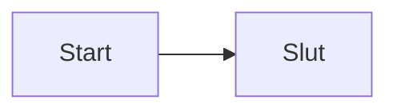

# Markdown Cheat Sheet

Dette dokument viser de mest almindelige og udvidede muligheder i Markdown.

---

## Overskrifter

# H1
## H2
### H3
#### H4
##### H5
###### H6

---

## Typografi

**Bold**  
_Italic_  
**_Bold + italic_**  
~~Strikethrough~~  
`Inline code`

> Blockquote

---

## Lister

### Punktlister

- Punkt
  - Underpunkt
    - Under-underpunkt

### Nummererede lister

1. Første
2. Anden
3. Tredje

### Opgavelister

- [ ] Uafsluttet
- [x] Afsluttet

---

## Links

[Linktekst](https://example.com)  
[Link med titel](https://example.com "Titeltekst")

---

## Billeder


---

## Kodeblokke

```javascript
console.log('Hello world');
```

## Tabeller

| Kolonne 1 | Kolonne 2 | Kolonne 3 |
| --------- | --------- | --------- |
| Celle A   | Celle B   | Celle C   |
| Celle D   | Celle E   | Celle F   |

---

## Escape af tegn

\*stjerne\*
\# hashtag

---

## Autolinks (GitHub)

https://github.com
<https://github.com>

---

## Footnotes (GitHub)

Tekst med fodnote.[^1]

[^1]: Dette er fodnoten.

---
## Sammenfoldelige sektioner (GitHub)

<details>
<summary>Klik for at åbne</summary>

Indhold her.

</details>

---
## Emojis (GitHub)

:smile:
:rocket:
:thumbsup:

---

## Mentions (GitHub)

@brugernavn
#123 issue reference

---

## Task-lister i PR/Issues (GitHub)

- [ ] Opgave 1
- [x] Opgave 2

---

## Definition Lists (GFM understøtter ikke officielt, men nogle renderere gør)

Term
: Definition

---

## Math (hvis renderer understøtter det)

Inline: $E = mc^2$

Block:

$$
a^2 + b^2 = c^2
$$

---

## Citater i flere niveauer

> Niveau 1
>
> > Niveau 2
> >
> > > Niveau 3

---



> [!NOTE]  
> Highlights information that users should take into account, even when skimming.

> [!TIP]
> Optional information to help a user be more successful.

> [!IMPORTANT]  
> Crucial information necessary for users to succeed.

> [!WARNING]  
> Critical content demanding immediate user attention due to potential risks.

> [!CAUTION]
> Negative potential consequences of an action.


