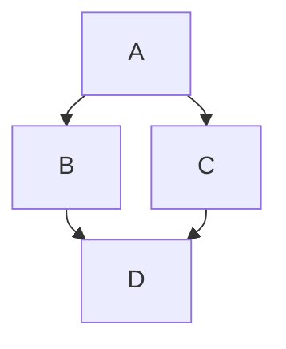
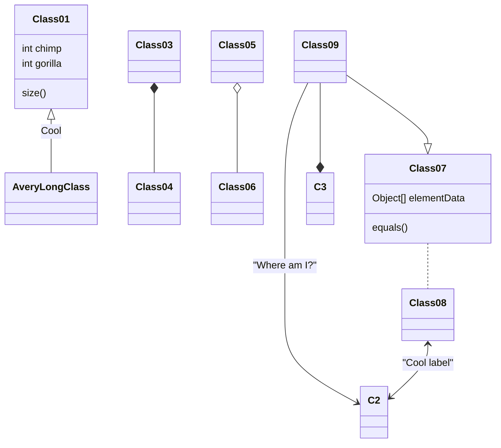

# 🏆 GFM Master Cheat Sheet

Dette indhold bliver nu automatisk lagt ind i "default" layoutet.

| Funktion | Status       |
| :------- | :----------- |
| Layout   | ✅ Virker    |
| CSS      | ✅ Tilkoblet |

## En sektion

Rene GFM kode ... kommer nok snart her

